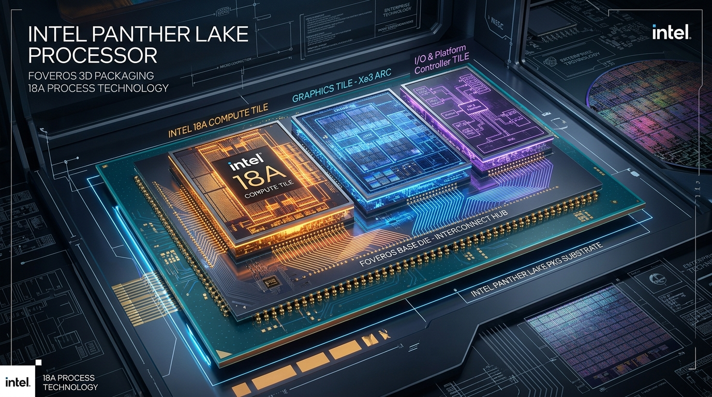
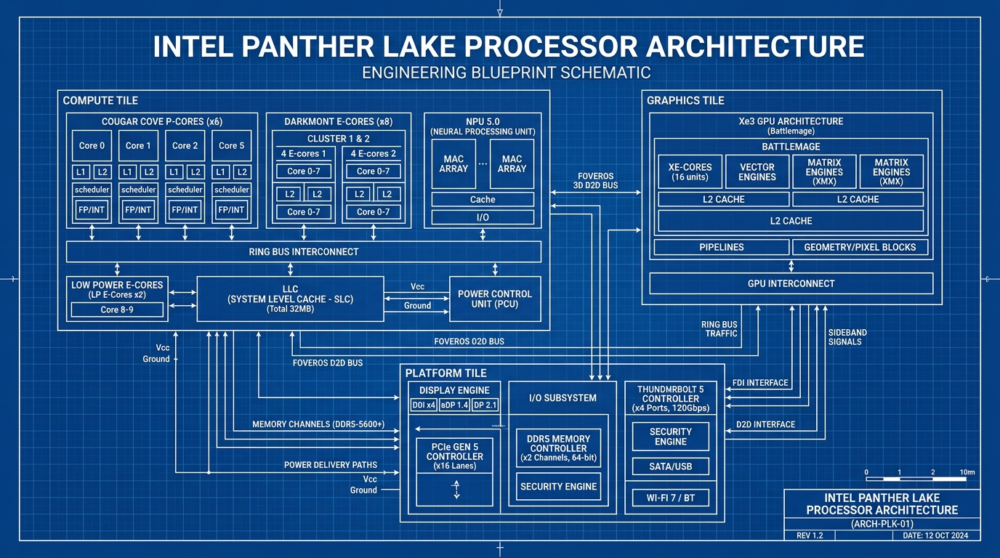

# Intel Panther Lake oneAPI Simulator Design Specification

This document details the architectural specification and software design for the Panther Lake (Core Ultra Series 3) disaggregated processor simulator, integrating Intel oneAPI (SYCL) hardware dispatch modeling.

---

## 1. Panther Lake SoC Architecture

Intel Panther Lake utilizes a disaggregated tile-based multi-chiplet packaging topology, linked by Intel's 2nd-generation Foveros 3D packaging.

### 1.1 Physical Stack Layout Design

### 1.2 Engineering Blueprint Schematic

Here is the engineering blueprint detailing the logical sub-blocks, memory channels, interconnect interfaces, and power delivery networks across the tiles:

---

### 1.3 Compute Tile (Intel 18A)
The Compute Tile houses the primary general-purpose execution units and memory interfaces:
- **P-Cores (Cougar Cove)**: Out-of-order execution, targeting high single-threaded IPC. Features 4 cycles L1D hit latency and 15 cycles L2 cache hit latency.
- **E-Cores & LP E-Cores (Darkmont)**: Optimized for multithreaded throughput efficiency and background tasks. Features 4 cycles L1D hit latency and 20 cycles L2 cache hit latency.
- **Neural Processing Unit (NPU 5)**: Designed for low-power AI acceleration. Features 4 Neural Compute Engines (NCEs), each executing up to 4096 INT8 MACs per cycle (50 TOPS capacity at 1.8 GHz).
- **System Level Cache (SLC)**: A 24MB cache shared dynamically between CPU cores and other on-die tiles via a high-speed Ring Bus interface.

### 1.4 Graphics Tile (TSMC N3E / Intel 3)
Built on the Xe3-LPG (Celestial) architecture, scaling up to 12 Xe-cores (each containing 8 Vector Engines and 8 Matrix Engines).
- **Vector Engines (VE)**: Execute 16 FP32 FLOPs per cycle.
- **Matrix Engines (XMX)**: Execute 128 FP16 operations (64 multiply-accumulate ops) per cycle.

### 1.5 Platform Controller Tile (TSMC N6)
Manages off-chip communications, housing:
- PCIe Gen 5 controller (up to 63 GB/s bandwidth).
- Thunderbolt 5 controller (up to 10 GB/s bandwidth).
- Dynamic Voltage and Frequency Scaling (DVFS) regulator to interpolate power/voltage states.

### 1.6 Foveros 3D Packaging Interconnect
Bridges the disaggregated tiles in three dimensions. Employs asymmetric interconnect bandwidth links:
- Compute to Graphics link: 256.0 GB/s.
- Compute to Platform Controller link: 128.0 GB/s.
- Graphics to Platform Controller link: 64.0 GB/s.

---

## 2. oneAPI Integration (SYCL Programming Model)

The simulator integrates a mock SYCL header (`sycl_mock.hpp`) that allows writing standard-conforming oneAPI syntax:
1. **Queues (`sycl::queue`)**: submitted tasks target specific devices (CPU, GPU, NPU).
2. **Handlers (`sycl::handler`)**: registers compute kernels.
3. **Execution (`parallel_for`)**: models data-parallel iteration, executing work-items over simulated execution engines.
4. **Memory (`sycl::buffer` / `sycl::accessor`)**: models buffer allocations and access patterns (Read/Write) across Foveros packaging and LPDDR5X channels.

---

## 3. Simulator Implementation Detail

The C++ source directory layout is:
- **`cores.cpp`**: Models Out-of-Order P-core instruction pipelines and in-order E-core execution.
- **`gpu.cpp`**: Simulates vector and matrix execution blocks inside the Xe3 architecture.
- **`npu.cpp`**: Simulates NCE arrays for matrix-multiplication operations.
- **`memory.cpp`**: Models cache tag lookup, LPDDR5X bandwidth limits, and System Level Cache (SLC) tag tag-evictions.
- **`fabric.cpp`**: Calculates path delays and bus contention over the Foveros links.
- **`platform.cpp`**: Models I/O latency and active power/thermal scaling.
- **`simulator.cpp`**: Integrates all components and simulates runtime metrics.
