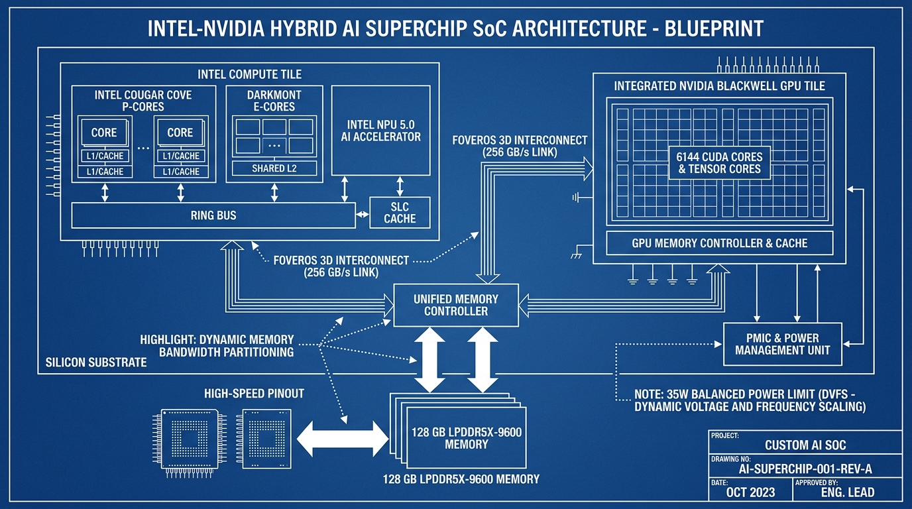

# Intel-NVIDIA Hybrid AI Superchip Design Specification

This document details the architectural specification, design choices, and software simulation framework for the custom hybrid AI Superchip SoC.

---

## 1. Architectural Schematic & Blueprint

---

## 2. Understanding Summary

*   **Objective:** Model and simulate a custom hybrid Intel-NVIDIA "AI Superchip" SoC running a 40 Billion parameter Large Language Model (LLM) locally on a laptop under tight power budgets.
*   **Target Workload:** 40B Parameter LLM running at native FP16 precision (80 GB active memory footprint).
*   **Key Constraints:**
    *   Shared 128 GB LPDDR5X-9600 memory pool (153.6 GB/s peak bandwidth).
    *   Strict 35W SoC package power limit.
    *   Integrated packaging utilizing Foveros 3D packaging.

---

## 3. Decision Log

| Decision ID | Topic | Selected Choice | Alternatives Considered | Rationale |
| :--- | :--- | :--- | :--- | :--- |
| **DEC-01** | GPU Integration | Integrated Blackwell GPU (6,144 cores) | Discrete RTX 4050 dGPU over PCIe Gen 5 | Eliminates PCIe copy latency; matches on-package "RTX Spark" concept. |
| **DEC-02** | Workload Dispatch | Coordinated Hybrid Split | GPU-only execution, NPU-only execution | Prompt processing is run on CPU/NPU for low-power, and token generation on GPU for performance. |
| **DEC-03** | Memory Allocation | Dynamic Bandwidth Partitioning | Static bandwidth split, GPU-first priority | Shifting 85% bandwidth dynamically to the active processor prevents memory bottlenecks. |
| **DEC-04** | Power Scaling | Balanced Battery-Saver Mode | Peak-Performance Burst Mode | Restricts SoC to 35W, dynamically scaling down CPU/GPU clocks under load to protect battery. |
| **DEC-05** | Model Precision | Native FP16 (80 GB footprint) | INT4 quantized (20 GB), FP8 mixed (40 GB) | Selected by user to achieve maximum model accuracy. |
| **DEC-06** | Simulator OOP Structure | Shared Base Core (`ExecutionCore`) | Isolated Tile modules with centralized manager | Groups CPU and GPU cores under a common class hierarchy for uniform simulation. |

---

## 4. Hardware Core Specifications

### 4.1 Execution Cores (`ExecutionCore`)
A common base class providing clock speed, cache status, instruction/operation retirement tracking, and dynamic power calculation.

-   **P-Cores (Cougar Cove):** 4 cores @ 5.0 GHz, IPC target 3.0, peak active power 4.0W/core.
-   **E-Cores (Darkmont):** 8 cores @ 3.5 GHz, IPC target 1.5, peak active power 1.2W/core.
-   **LP E-Cores:** 4 cores @ 2.5 GHz, IPC target 1.1, peak active power 0.5W/core.
-   **Blackwell GPU Cores (`XeGpuCore` / `BlackwellGpuCore`):** 12 core clusters (modeling 6,144 CUDA cores / 80 Tensor cores) @ 1.6 GHz, active power scaled to fit 35W limit.

### 4.2 NPU 5.0 Accelerator
Co-packaged accelerator with 4 Neural Compute Engines (NCEs) @ 1.8 GHz, handling prompt-processing matrix operations.

### 4.3 Memory Subsystem & Interconnect
-   **Unified Memory Controller:** Coordinates sharing of 128 GB LPDDR5X-9600 memory.
-   **Foveros 3D Interconnect:** Links Compute and Graphics tiles with an on-package 256 GB/s D2D link.
-   **System Level Cache (SLC):** 24MB shared cache.
