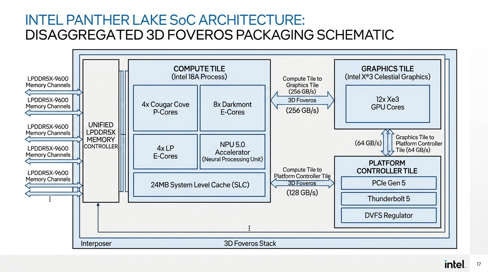
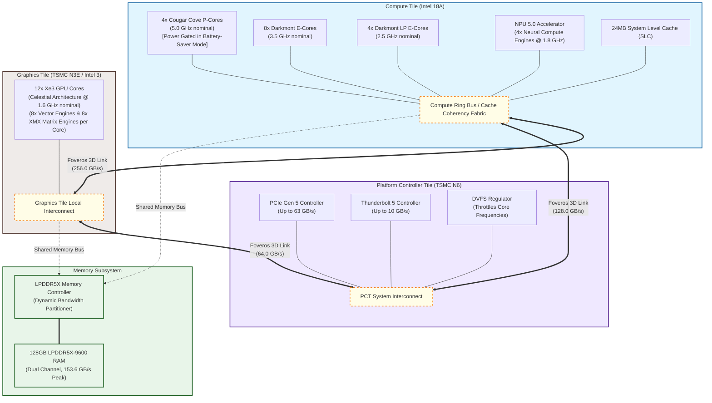

# Intel Panther Lake Modified Chip Architecture & Schematic Diagram

This document provides a detailed block-level schematic and control-flow diagram for the modified Intel Panther Lake processor (Core Ultra Series 3) simulated in the C++ oneAPI simulation framework.

---

## 1. Physical Chiplet Layout & Schematic Design

Below is the logical block-level blueprint schematic for the modified disaggregated chip packaging:



---

## 2. Chiplet Logical Block Schematic

The diagram below maps out the tiles, internal units, local buses, and interconnect links (Foveros 3D packaging and memory channels):



---

## 3. Dynamic Control Logic & Simulation Flow

The flowchart below traces the simulator's control sequences during workload dispatch, illustrating how DVFS, Memory Partitioning, and Battery-Saver logic interact.

```mermaid
flowchart TD
    %% Styling
    classDef decision fill:#fff9c4,stroke:#fbc02d,stroke-width:2px;
    classDef process fill:#e8f5e9,stroke:#2e7d32,stroke-width:1px;
    classDef startend fill:#eceff1,stroke:#37474f,stroke-width:2px;
    classDef loop fill:#f3e5f5,stroke:#8e24aa,stroke-width:2px;
    
    Start([Start Workload Simulation]) --> CheckSaver{Battery-Saver Active?}
    class CheckSaver decision;
    
    %% Battery-Saver Path
    CheckSaver -- Yes --> GatePCores["Power-Gate P-Cores<br/>(Clamp dynamic/leakage power to 0W)"]
    GatePCores --> RouteULP["Route CPU Workload:<br/>70% to E-Cores, 30% to LP E-Cores"]
    RouteULP --> QuantizeINT4["Scale Model Precision to INT4<br/>(Quantize weights, reduce footprint by 4x)"]
    QuantizeINT4 --> Set15WTDP["Set Target Package TDP = 15.0W"]
    class GatePCores,RouteULP,QuantizeINT4,Set15WTDP process;
    
    %% Normal Path
    CheckSaver -- No --> RouteNormal["Route CPU Workload:<br/>70% to P-Cores, 30% to E-Cores (High Power)"]
    RouteNormal --> RunFP16["Run Native FP16 Model Precision<br/>(Full memory footprint)"]
    RunFP16 --> Set35WTDP["Set Target Package TDP = 35.0W"]
    class RouteNormal,RunFP16,Set35WTDP process;
    
    %% Dynamic Bandwidth Partitioning
    Set15WTDP & Set35WTDP --> DetectPhase{Detect Workload Phase}
    class DetectPhase decision;
    
    DetectPhase -- "NPU Active Only" --> AllocNPU["Partition Bandwidth:<br/>85% NPU, 15% CPU/GPU"]
    DetectPhase -- "GPU Active Only" --> AllocGPU["Partition Bandwidth:<br/>85% GPU, 15% CPU/NPU"]
    DetectPhase -- "GPU & NPU Both Active" --> ContentionSplit["Partition Bandwidth:<br/>60% GPU, 30% NPU, 10% CPU/others"]
    class AllocNPU,AllocGPU,ContentionSplit process;
    
    %% DVFS Power Throttling Loop
    AllocNPU & AllocGPU & ContentionSplit --> EstPower["Calculate Total Package Power Draw<br/>(Sum CPU, GPU, NPU, Platform, Cache)"]
    class EstPower loop;
    
    EstPower --> CheckTDP{Total Power > TDP Limit?}
    class CheckTDP decision;
    
    CheckTDP -- Yes --> CheckFloor{Frequencies > Minimum Floor?<br/>(P-core > 1.5G, E-core > 1.0G, GPU > 0.8G)}
    class CheckFloor decision;
    
    CheckFloor -- Yes --> ScaleFreq["DVFS Power Throttling:<br/>Step down CPU & GPU frequencies by 0.1 GHz"]
    ScaleFreq --> EstPower
    class ScaleFreq process;
    
    CheckFloor -- No --> RunSim["Execute Cycle-Approximate Simulation Step"]
    CheckTDP -- No --> RunSim
    class RunSim process;
    
    RunSim --> ResetStates["Reset active power metrics to nominal<br/>via reset_active_power()"]
    ResetStates --> End([End Workload Simulation])
    class ResetStates process;
    class Start,End startend;
```
